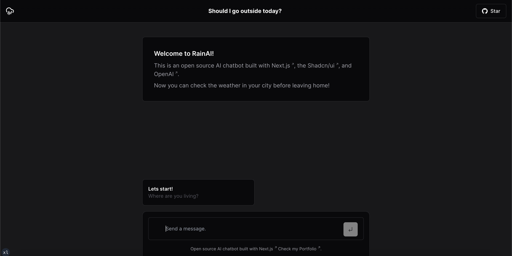

<a>
  
  <h1 align="center">RainAI Chatbot</h1>
</a>

<p align="center">
  An open-source AI chatbot built with Next.js, the Vercel, OpenAI, and Shadcn. You can check the weather in your city before leaving home!
</p>

<p align="center">
  <a href="#features"><strong>Features</strong></a> ·
  <a href="#model-providers"><strong>Model Providers</strong></a> ·
  <a href="#running-locally"><strong>Running locally</strong></a> ·
  <a href="#authors"><strong>Author</strong></a>
</p>
<br/>

## Features

- [Next.js](https://nextjs.org) App Router
- React Server Components (RSCs), Suspense, and Server Actions
- Support for OpenAI
- [shadcn/ui](https://ui.shadcn.com)
  - Styling with [Tailwind CSS](https://tailwindcss.com)
  - [Radix UI](https://radix-ui.com) for headless component primitives
  - Icons from [Phosphor Icons](https://phosphoricons.com)

## Model Providers

This template ships with OpenAI `gpt-3.5-turbo` as the default.

## Running locally

You will need to use the environment variables [defined in `.env.example`](.env.example) to run Next.js AI Chatbot. It's recommended you use a `.env` file is all that is necessary.

> Note: You should not commit your `.env` file or it will expose secrets that will allow others to control access to your various OpenAI and authentication provider accounts.

1. Install packages
2. Add your credentials on env
3. Just run:

```bash
npm install
npm dev
```

Your app template should now be running on [localhost:3000](http://localhost:3000/).

## Author

- John Moura ([LinkedIn](https://www.linkedin.com/in/jovimoura10/)) - [Instagram](https://www.instagram.com/ojohndev/)
